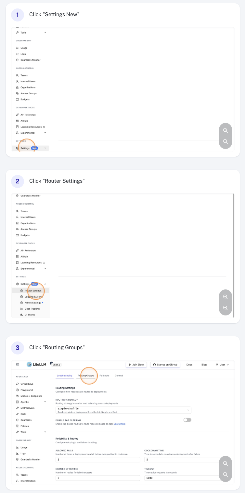
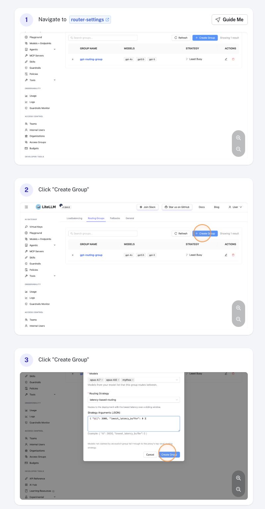
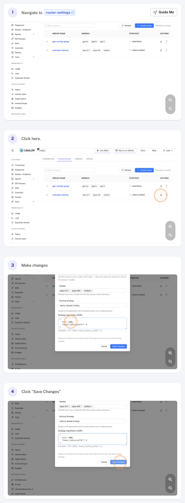
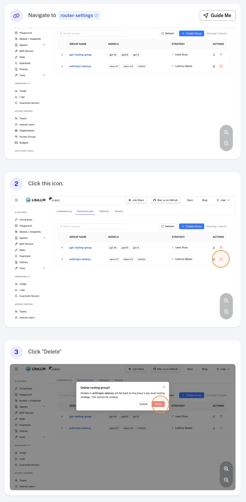

import Image from '@theme/IdealImage';

# Manage Routing Groups

Routing groups let you apply different routing strategies to different models in the same router — for example, latency-based routing for `gpt-4o` while cheaper models use simple-shuffle. You can manage them from the LiteLLM dashboard without editing your `proxy_config.yaml`.

For the conceptual overview and full strategy reference, see [Routing Groups - Per-Model Strategies](../../routing.md#routing-groups---per-model-strategies).

> Click any screenshot below to open the full Scribe walkthrough.

## Via the UI

### Routing Group Settings

Navigate to **General Settings** in the sidebar and select the **Routing Groups** section.

[](https://scribehow.com/viewer/Accessing_Routing_Groups_in_Settings__hxNoFOtLQeSfOvcLYgzXzA)

### Create a Routing Group

Click **Add Routing Group**, then fill in:

- **Group name** — a unique identifier (e.g. `anthropic-latency`). The name `default` is reserved.
- **Models** — one or more `model_name`s from your model list. Each model may belong to at most one group.
- **Routing strategy** — the strategy to apply to this group (e.g. `latency-based-routing`, `usage-based-routing-v2`, `simple-shuffle`).
- **Routing strategy args** *(optional)* — strategy-specific overrides such as `ttl`, `rpm`, or `tpm`.

Click **Save** to create the group.

[](https://scribehow.com/viewer/Create_a_New_Latency_Based_Routing_Group__y3EoV7U7QOaNdR1YrD-03w)

### Edit a Routing Group

Click the group row in the table to open it, then update any field — for example, change the `ttl` under **Routing strategy args** to tune how quickly the strategy reacts to latency changes. Click **Save** to apply.

[](https://scribehow.com/viewer/How_To_Configure_Strategy_Arguments_In_Router_Settings__u98H3SRAQKK-qHOa1Tbx9g)

### Delete a Routing Group

Click the **Delete** action on the group row and confirm. Models that were in the deleted group immediately fall back to the default routing strategy.

[](https://scribehow.com/viewer/How_To_Delete_A_Router_Setting__O96ij__rQj6QjOurwOqSFA)

## Via `proxy_config.yaml`

You can also define routing groups in your proxy configuration file. Settings configured via the UI are persisted and override the values defined here.

```yaml
router_settings:
  # fallback strategy for models not in any explicit group
  routing_strategy: simple-shuffle

  routing_groups:
    - group_name: anthropic-latency
      models: [claude-sonnet, claude-opus]
      routing_strategy: latency-based-routing
      routing_strategy_args:
        ttl: 3600
```

See [Routing Groups - Per-Model Strategies](../../routing.md#routing-groups---per-model-strategies) for the full schema, multi-group examples, and runtime update behavior.

## Notes

- Each `model_name` may belong to **at most one** routing group. Overlap is rejected.
- The group name `default` is reserved for the implicit fallback group.
- Updates take effect immediately — per-group state is rebuilt on save.
